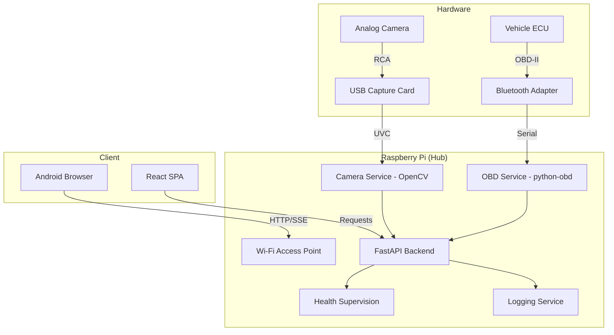

# VanDash v1 Architecture

## System Topology

## Key Designs

1. **Offline-First**: No internet required. Local AP provides DNS and Static IP (192.168.4.1).
2. **Resilience**: Subsystems run in isolated threads. Failure in one (e.g., OBD) does not crash the Dashboard.
3. **Low Latency**: Rear camera uses MJPEG streaming for near-live response during reversing.
4. **Observability**: Every service state is tracked. Errors are surfaced to the UI, not hidden in logs.
